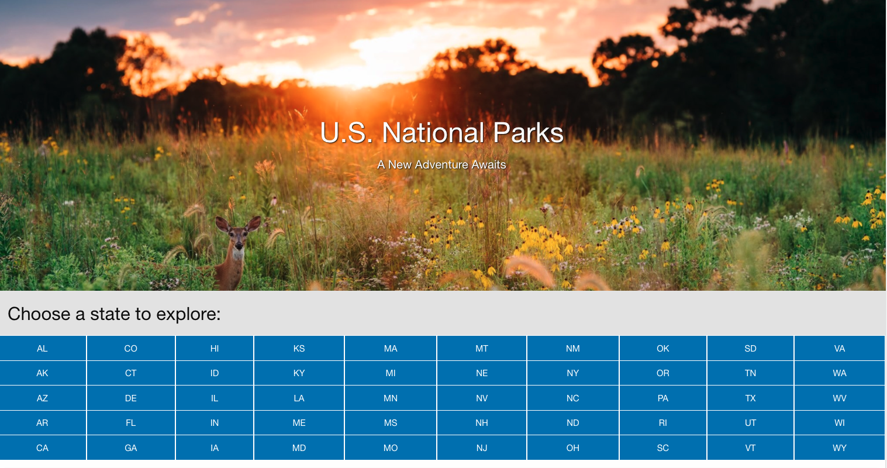

# Find-a-National-Park-app

 
 
Our National Park app helps users explore new parks across the United States based off criteria they select. Upon page load, the user is prompted to search for a park based off location or activity. When searching by location, the user will see a list of all 50 states. Upon selecting a state, the page will load a generated list of all the National Park's within that given state, along with the current weather conditions at each park and more information about the park. When searching by activity, the user will see a generated list of all National Park's across the country that have that activity.
 
 
<strong>Technology:</strong> OpenWeather API, National Park Service API, Foundation CSS
  
<strong>Project Members:</strong> Yer M., Gustaf G., Joe R., Aly M., Laith A.
 
 
<strong> Deployed Link: </strong> <a href="https://yermasog.github.io/Find-a-National-Park-app/">https://yermasog.github.io/Find-a-National-Park-app/</a>

<strong> Repository Link: </strong> https://github.com/yermasog/Find-a-National-Park-app